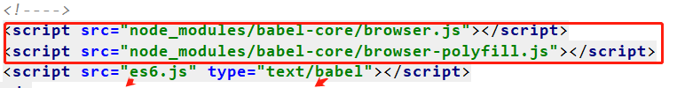

# ES6转换为ES5的几种方式

1. ## 直接命令行使用babel转换
### 全局安装babel-cli

  `npm install -g babel-cli `
- 安装转换插件（此插件定义了 ES2015 转码规则，相当于是字典的功能）：

  `npm install babel-preset-es2015 -save `
### 命令行转换

  `babel es6.js --out-file es5.js --presets es2015 `
### 自动转换

  `babel es6.js -w --out-file es5.js --presets es2015 `
### 在代码里就直接使用转换好的es5的js文件就可以了。

2. ## 使用 Browsersync 实时刷新页面和 Babel-Core 实时转换ES6

Browsersync 能让浏览器实时、快速响应您的文件更改（html、js、css、sass、less 等）并自动刷新页面。

### 安装Browsersync

`npm install -g browser-sync`

### 安装 babel-core（在网页上实时转换 ES6 到 ES5）

`npm install babel-core@5 -save `
>注意：从 Babel 6.0 开始，不再直接提供浏览器版本，而是要用构建工具构建出来。如果你 没有或不想使用构建工具，可以通过安装 5.x 版本的 babel-core 模块获取

### HTML 页面引入 babel-core 实时转换 js 代码

/node_modules/babel-core/browser.min.js
/node_modules/babel-core/browser-polyfill.min.js

